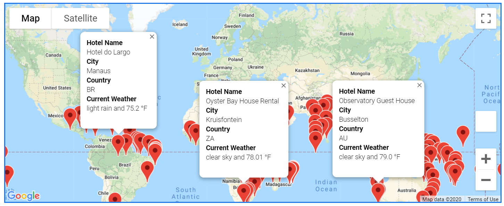

# World Weather Analysis (APIs)
## Overview of Project/Purpose
In this module, the aim was to gather data from an API (Application
Programming Interface), which essentially allows two applications to
talk to each other. With the API, we're able to retrieve data that is
within the website rules. Here, we're collecting weather data of cities
from all over the world to identify possible travel destinations and nearby hotels.

---
## Analysis/Results

**Weather_database**: For this analysis, we're using APIs to retrieve
the weather of various cities. Using our python skills in the jupyter
notebook, we use numpy to generate a random list of latitude and longitude
combinations. Using these numbers as coordinates, we look for unique cities
to pass through the OpenWeatherMap API. Here we are able to create a dataframe
that provides different weather data descriptions such as "Max Temp",
"Humidity", "Cloudiness", "Wind Speed", and "Current Description". 
As a result, the dataframe is converted into a csv file to be used for
the other deliverables.

**Vacation_Search**: Next, we're creating a customer travel destination map.
Using `gmaps`, we're able to pull in our API key from the Google Maps Platform.
In addition, we're bringing in the csv file of cities and their weather conditions.
By adding `input` code, it identifies the customers preferred temperature
for travel. This then creates a dataframe that will be used to look for nearby
hotels within 5,000 meters of that city. The Google API should be able to provide
JSON (JavaScript Object Notation) data that generates a hotel name for the dataframe.
Continuing on, `gmaps` should be able to produce a map that can generate
city markers on the customers possible vacation destinations. Clicking the
markers should provide more details related to the cities weather conditions, like the following:

**Vacation_Itinerary**: Based on the csv file from the vacation search deliverable,
this last step enables the code to create a travel itinerary for the customer.
Re-using different codes from the module/challenge, we're able to 
recreate the map of travel destinations and select 4 cities to create a
driving route using the Directions API from the Google Maps Platform.
Using `loc`, `to_numpy` , and `gmaps`, I'm able to get Australian cities mapped
to look like the following:

In addition, we can see the different weather conditions of these 4 cities
using the `gmaps.marker_layer`. 

### Conclusion

Overall, API proved to have its pros and cons. Encountering major painpoints, I found myself most frustrated throughout the set-up.
Initially, jupyter notebook could not recognize the given API. Going through the documentation and checking off possible solutions,
it took hours to try and fix what was occurring. Messing around with the platform, billing, enabling different programs, no solution
seemed to arise. However, hours later, without doing anything different, the API was working and the maps were able to generate. Then,
a few hours after, the maps were unable to appear again. Using the console and trying to identify errors, it seemed the widget could
not initiate. This sent me down a rabbit-hole of pip installs and version-checking. It wasn't until a day later, the issue was the terminal
being called, Anaconda Prompt(anacoda3) vs Anacoda Prompt(pythondata). Nevertheless, after jumping through these many hurdles, I can see how useful
APIs can be in gathering data and generating an analysis quickly and relevant to the present time.
